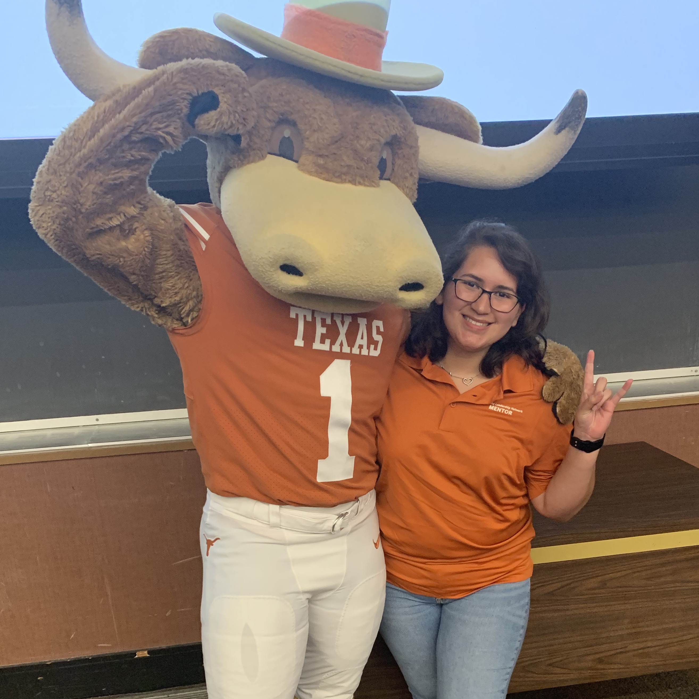
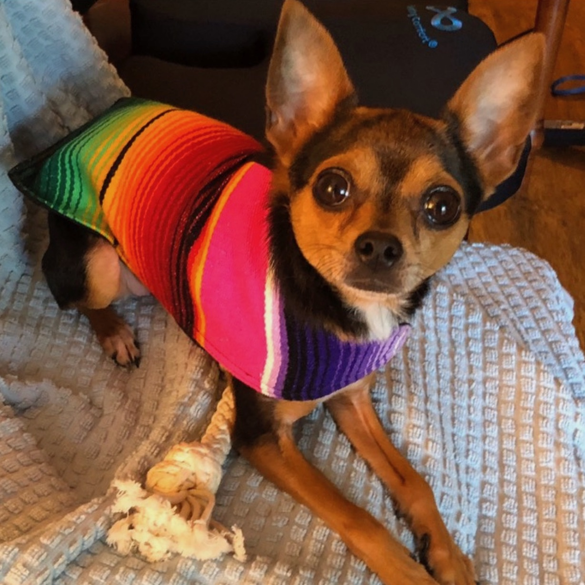
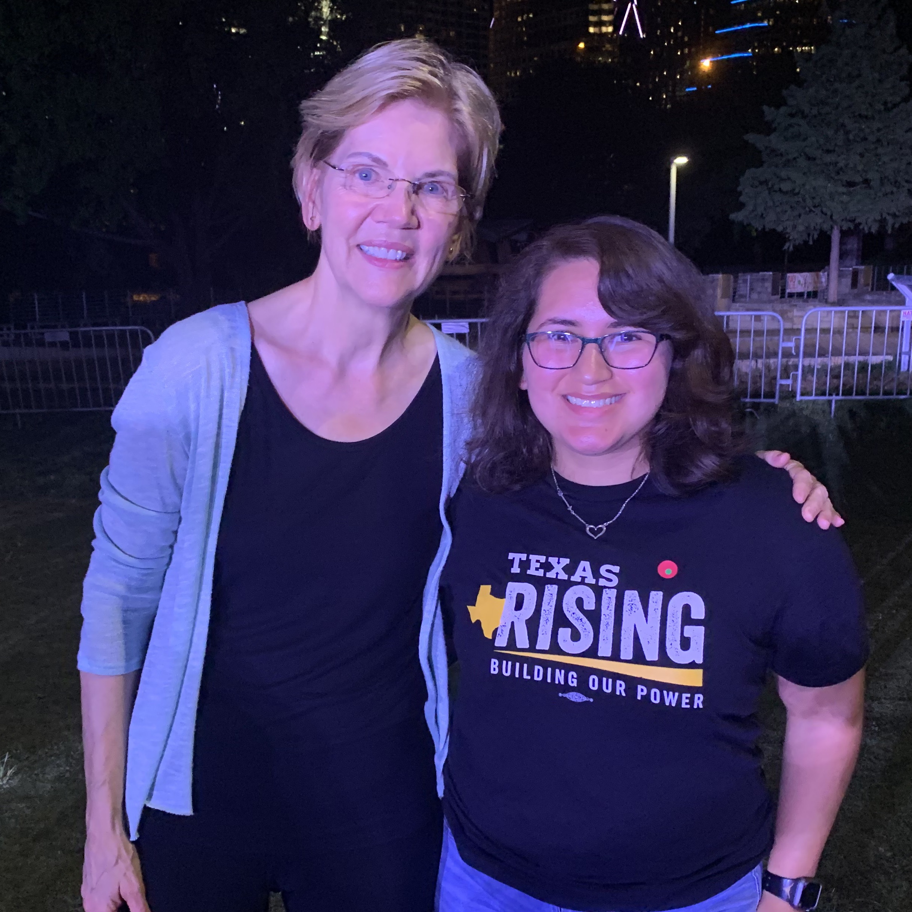

<!--**COMMENT** Here is where you can change window title and page title.  -->
<head>
	<title>The Personal Website of Ariana Samaniego</title>
	

</head>

<header>

	<!-- if you like, you can add a favicon in code below.  This is just for fun so google favicon to learn what it is-->
	<!-- The favicon is a small picture.  Currently your site will link to a favicon in Clint's folder on webspace which is why you'll see one.  Download a favicon and put in your webspace folder and then update link below to make this work for you-->
	

		<h1>Welcome to Ariana's Awesome HTML5 Webpage</h1>
		<h2>"All progress takes place outside your comfort zone."</h2>

</header>

<body>

			<h3>

			<u>Home</u>
			||
			<a href="file:///Users/arianasamaniego/Desktop/HTML%20Assignment/page2.html">More Info</a>
			<!--This link above currently links to the page2 file in Clint's folder on the webspace server.  You'll need to update it to point to your page2 file on webspace -->

			</h3>

			 						<!--HINT - This is the code to add a blank line-->

			<h1>Who am I?</h1>
			
My name is Ariana Samaniego and I am from San Antonio, Texas.
      I am a neuroscience major with a minor in business and psychology.
      Pre-pandemic, I was actively involved in my orgs and volunteered frequently around the Austin area.
      I also enjoyed watching UT sports, excercising, hanging out with friends and exploring Austin.
      Currently, my time is spent working, taking summer classes and finding new books to read.

			
			
			

		  

		<h1>My Work Experience</h1>

				<li><u>IC2 Institute</u> - <i>Student Associate</i> - (June 2020 - Present)
				 
				<li><u>Freshman Research Initiative</u> - <i>Mentor</i> - (January 2020 - Present)
				 
				<li><u>University Leadership Network</u> - <i>Peer Mentor</i> - (August 2019 - Present)
				 

		 						<!--HINT - This is the code to add a blank line-->
		
					<!--HINT - This is the code to create a horizontal line-->

		<h1>Favorite links to websites I frequent</h1>
			
				<li><a href="https://open.spotify.com/show/3DgfoleqaW61T2amZQKINx" target="_blank">I use spotify a lot to find new podcasts. This links to one of my favorite podcasts.</a></li>
				<li><a href="http://youtube.com/" target="_blank">I constantly go to Youtube to relax and watch fun videos</a></li>
        <li><a href="https://slickdeals.net" target="_blank">I like to look at this website because they have a bunch of deals from things like groceries to tech</a></li>
				<li><a href="https://www.cbs.com/shows/big_brother/" target="_blank">A great reality TV show. Highly recommend if you're looking for a good summer binge.</a></li>
			

		 						<!--HINT - This is the code to add a blank line-->
		

		<h1>Contact me via links below</h1>
		<!--link to email-->
		<a href="mailto:ariana.samaniego@utexas.edu">ariana.samaniego@utexas.edu</a>
		 
		<a href="https://twitter.com/arianasamanieg0" target="_blank">@arianasamanieg0</a>
		 
    <a href="https://www.instagram.com/ariana.samaniego/" target="_blank">@ariana.samaniego</a>
		 
		<a href="https://www.linkedin.com/in/ariana-samaniego-907a2b1a9/" target="_blank">My Linked In Profile</a>

<footer class=clearfix>
		
Copyright &copy; 2020 <strong>Ariana Samaniego</strong>. All Rights Reserved.
